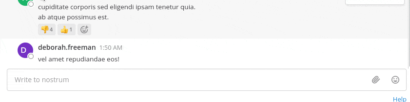
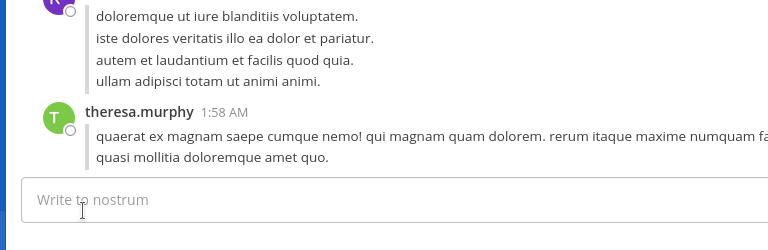

# Disclaimer

**This repository is community supported and not maintained by Mattermost. Mattermost disclaims liability for integrations, including Third Party Integrations and Mattermost Integrations. Integrations may be modified or discontinued at any time.**

# Mattermost Profanity Filter Plugin (Beta)

This plugin allows you to censor profanity on your Mattermost server. The plugin checks all messages for matches against the configured "Bad words list" before they are posted to any channel. The characters in any word matches are replaced with a series of "\*"s.

**Supported Mattermost Server Versions: 5.2+**

## Installation

1. Go to the [releases page of this Github repository](https://github.com/mattermost/mattermost-plugin-profanity-filter/releases) and download the latest release for your Mattermost server.
2. Upload this file in the Mattermost System Console under **System Console > Plugins > Management** to install the plugin. To learn more about how to upload a plugin, [see the documentation](https://docs.mattermost.com/administration/plugins.html#plugin-uploads).
3. Activate the plugin at **System Console > Plugins > Management**.

## Usage

You can edit the bad words list in **System Console > Plugins > Profanity Filter > Bad words list**.
In this list, you can use Regular Expressions to match bad words. For example, `bad[[:space:]]?word` will match both `badword` and `bad word`.

Choose to either censor the bad words with a character or reject the post with a custom warning message:

